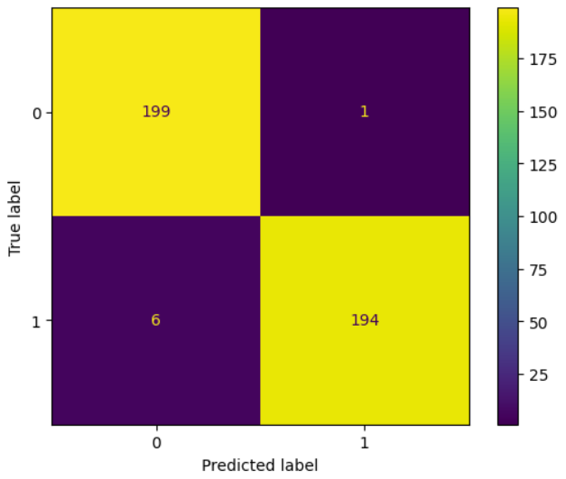

# UAV-RF-Jamming-ML-Detection
## Machine learning–based detection of radio frequency jamming attacks on UAV communication systems using real RF spectral data. Implements and compares Support Vector Machine and Random Forest classifiers. Analyzes detection accuracy and false-alarm tradeoffs for cyber-physical security applications.

## About The Project
This project applies supervised machine learning to detect radio frequency jamming attacks in UAV communication systems. Support Vector Machine and Random Forest classifiers are implemented and evaluated to analyze detection performance and false-alarm tradeoffs for cyber-physical security applications.

### Built With
* 
* 
* 

## Getting Starterd
### Prerequisites
You will need Python experience and access to Google Colab to run this project. Access to a high performnce computer is optional but not required. It will allow larger samples of data to be run producing more sophisticated results.

## How to Run

The notebooks in the `notebooks/` directory can be executed directly in Google Colab or any local Jupyter environment.

### Dataset

This project uses the RF Jamming Dataset (Herzalla et al., 2024), which contains RF measurements labeled as benign communication or malicious jamming activity. Each sample consists of multiple numeric RF features describing signal power and noise characteristics. These features and a short description are lsited below:

- **freq1**  
  Center frequency of the monitored RF channel (MHz). Represents the operating frequency at which the spectral scan was captured.

- **noise**  
  Background noise power measured in the channel. Elevated noise levels may indicate wideband interference or jamming activity.

- **max_magn**  
  Maximum magnitude observed in the received RF spectrum during the scan. Sudden increases can indicate the presence of an active jammer.

- **total_gain**  
  Total receiver gain applied by the RF front-end and amplifier chain (in dB). Used to normalize and interpret measured signal power levels.

- **base_pwr**  
  Baseline received power level under nominal (non-jammed) conditions. Serves as a reference point for detecting abnormal power increases.

- **rssi**  
  Received Signal Strength Indicator reported by the RF hardware. Higher-than-expected RSSI values may correspond to strong interference sources.

- **relpwr_db**  
  Received power relative to the baseline power level (in dB). Captures deviations from normal signal conditions.

- **avgpwr_db**  
  Average received power over the observation window (in dB). Smooths short-term fluctuations and highlights sustained interference.

- **Output**  
  Binary class label indicating signal type:  
  `0` = benign RF communication  
  `1` = malicious RF jamming activity

- **Source file**  
  Identifier of the original data file from which the sample was extracted. Used for traceability and metadata reference; not used as a model feature.

The dataset is not included in this repository as due to licensing restrictions.

### Results
Both Support Vector Machine and Random Forrest machine learning models were trained for this project. These supervised models evaluated and classified RF spectral samples as either benign, normal communication or as malicious jamming attacks. Model performance was evaluated using accuracy, precision, recall, F1 score, and confusion matrix analysis.

Both models achieved strong overall performance, with classification accuracies exceeding 97%. However, each model showed us different operational tradeoffs:

* The SVM achieved an accuracy of approximately 98.5% and demonstrated a balanced decision boundary. Its confusion matrix shows an equal number of false positives and false negatives. This indicates a tradeoff between detection sensitivity and false-alarm rate. This behavior makes the SVM suitable for scenarios where missed detections and false alarms are considered equally costly.

* The Random Forest achieved an accuracy of approximately 98.3%. It exhibited more conservative behavior. It produced fewer false positives than the SVM but missed a larger number of jamming events. This indicates a preference for avoiding false alarms at the expense of reduced detection sensitivity.

It is worth noting that the accuracy of both models is exceptionally high. This was likely caused by the limited size of the dataset subset used for training and evaluation. Future work could explore model performance on the full dataset using high-performance computing resources to better assess scalability and generalization.

Confusion matrices for both models are provided in the figures/ directory and illustrate these tradeoffs clearly. Overall, the results demonstrate that machine learning can effectively detect RF jamming activity in UAV communication systems, and that model selection can be tailored to mission requirements depending on whether sensitivity to attacks or avoidance of false alarms is prioritized.

**SVM Confusion Matrix**

**Random Forrest Confusion Matrix**

## Key Takeaways

- Machine learning is effective for detecting RF jamming in UAV communications.  
- SVM and Random Forest models exhibit different sensitivity and false-alarm tradeoffs.  
- Model choice should reflect operational priorities.  
- Larger-scale evaluation using high-performance computing is an important next step.

## Paper

A detailed description of the methodology, dataset preprocessing, model design, and experimental results is provided in the accompanying paper:

**Detecting Radio Frequency Jamming Attacks on Unmanned Aerial Vehicles Using Machine Learning**  
Garrison Gralike, Florida State University  
[PDF](Report/Gralike_Detecting_RF_Jamming_Using_ML_Report.pdf)

## Future Work

* Evaluation on larger and more diverse RF datasets
* Testing generalization across different environments
* Deployment considerations for edge or onboard UAV systems
* Exploration of adaptive or online learning techniques

## Contributors

## Contact
- [LinkedIn](https://www.linkedin.com/in/<garrison-gralike-56164b253>) – <ggralike1@gmail.com>

